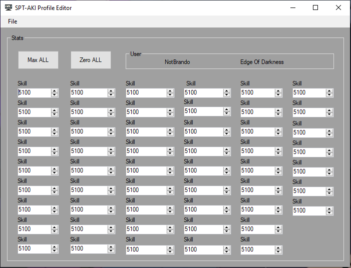

# ***PMCEditor***
> Edit the skill points for your PMC on [Single Player Tarkov (SPT).](https://hub.sp-tarkov.com/files/file/1312-pmc-skill-editor/)

# ***Installation***
1. Download and Unzip PMCEditor from [Releases](https://github.com/BrandoTheDev/PMCEditor/releases/download/v1.0.2/PMCEditor.zip)
2. Place PMCEditor and the Netownsoft Dll anywhere together.
4. Run the program and click File-> Open
6. Find the folder SPT-AKI/user/profiles/
7. Open the profile inside the folder. (Usually its an id like: 0xkjh234786sdf873234)
8. Edit the stats to your liking.
9. File-> Save-> Close the program

### If something goes wrong or you want to revert changes

> There is a backup made that has the id.backup (0xkjh234786sdf873234.backup)

1. Delete the edited profile completely
2. Remove the ".backup" extension off of the file

