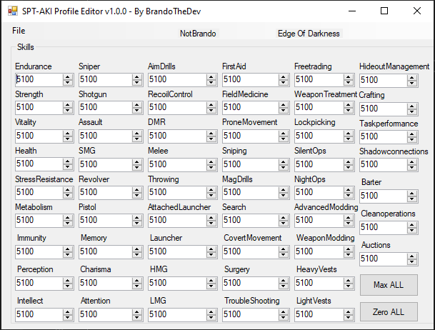

# ***PMCEditor***
> Edit the skill points for your PMC on [Single Player Tarkov (SPT).](https://hub.sp-tarkov.com/files)

# ***Installation***
1. Download and Unzip PMCEditor from [Releases](https://github.com/BrandoTheDev/PMCEditor/releases/download/v1.0.0/PMCEditor.exe)
2. Place PMCEditor on your desktop.
3. Locate your SPT-AKI folder.
4. Run the program and click "File"->"Open"->
5. Find the folder SPT-AKI/user/profiles/
6. Open the profile inside the folder.
7. Edit the profile to your liking.
8. File->Save->Close the program

# ***Roadmap***
> This program was a random thought during 48 hours of no sleep.
> Its been so much fun tho I plan on doing these changes..

 - Refactor anything hardcoded
 - Make an actual Save function
 - Break code into classes
 - ACTUAL ERROR CHECKING!
 - Make Backups of profiles
 - Actually Design the UI
 - Remove all placeholder text
 - Refactor the max/min buttons
